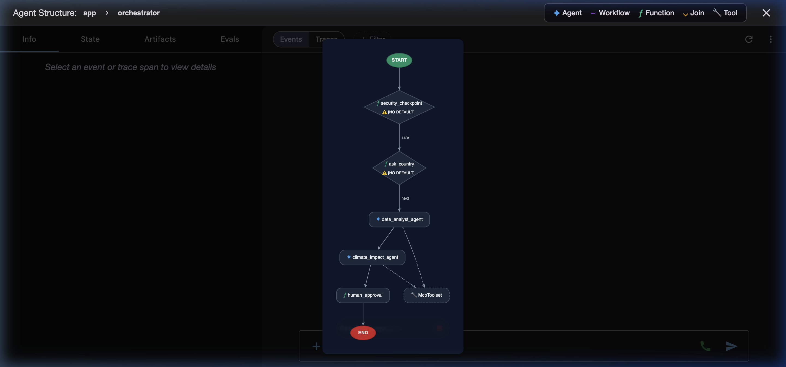
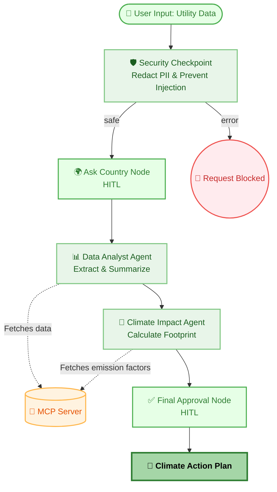
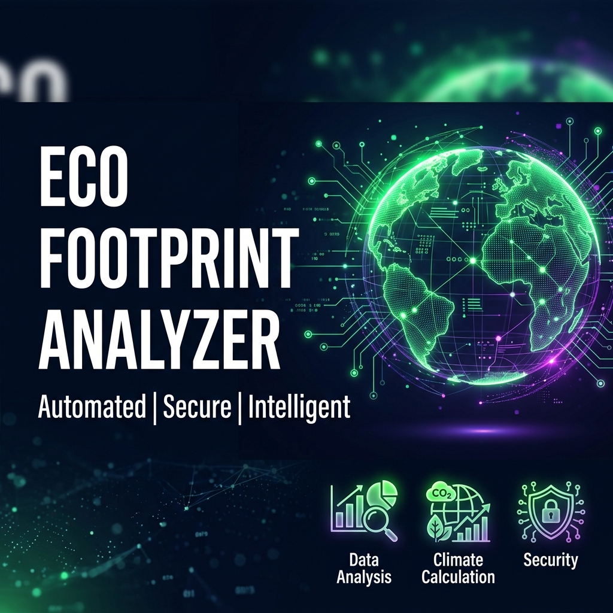
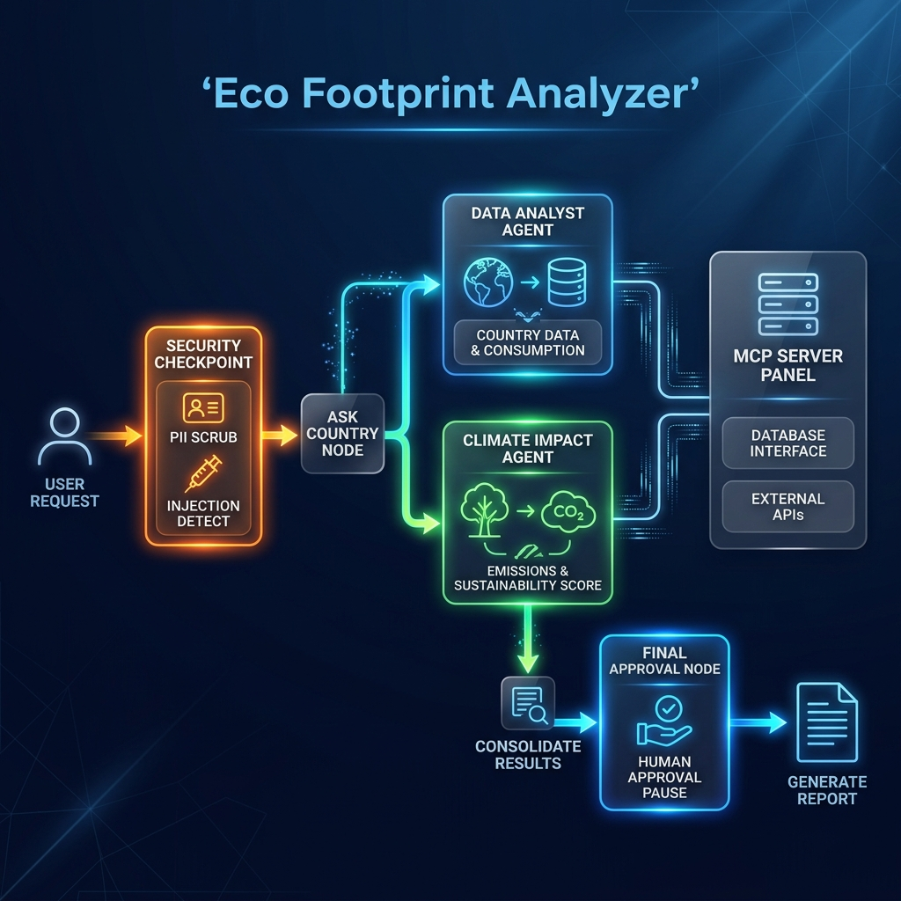
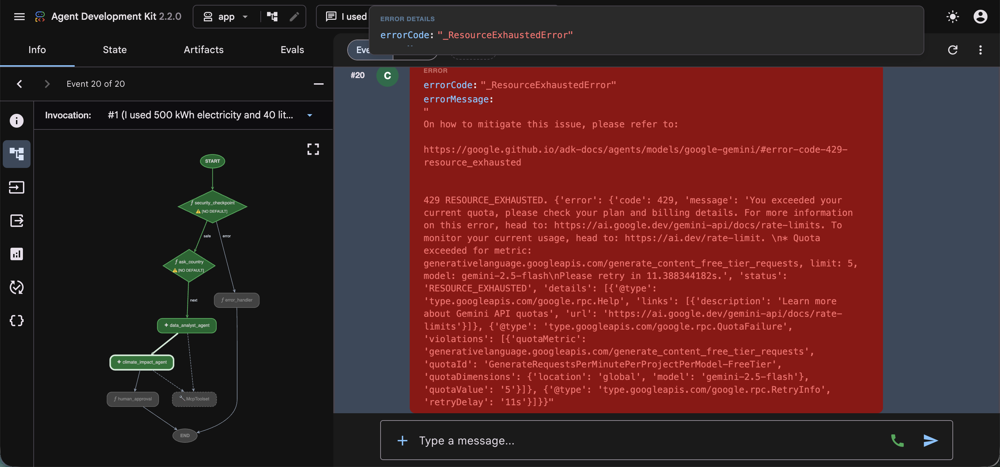

# 🌍 Eco Footprint Analyzer

**Eco Footprint Analyzer** is an intelligent, multi-agent AI application designed to help users calculate, understand, and reduce their carbon footprint. Powered by Google's Agent Development Kit (ADK) and Gemini, it seamlessly processes raw utility data to generate actionable climate impact plans. Built with a core focus on empowering global sustainability, it provides deeply localized insights to drive climate action for any nation. For instance, its detailed regional factors actively support monumental national goals like India's "Panchamrit" vision of achieving Net Zero emissions by 2070.

## 🏗️ Agent Architecture

The application uses an orchestrated multi-agent workflow to securely process user data. Below is the visual output from the ADK Playground:



### Logical Workflow Details

> **Note:** The code block below automatically renders as a beautiful graphical flowchart when this README is viewed on GitHub or a compatible Markdown viewer.



### 🌟 Key Features
- **Data Analysis Agent:** Automatically extracts and summarizes utility and usage data.
- **Climate Impact Agent:** Calculates precise carbon footprint metrics (kg CO2) based on region-specific emission factors.
- **Privacy-First Security:** Built-in security checkpoints to automatically redact PII (Aadhaar, PAN, SSN, Emails, etc.) and block prompt injection attacks.
- **Human-in-the-Loop (HITL):** Interactively requests user location and requires explicit human approval before finalizing the climate action plan.
- **MCP Integration:** Uses the Model Context Protocol (MCP) to seamlessly fetch real-time emission factors and utility data.
- **Graceful Error Handling:** Automatically catches and gracefully handles API quota limits (e.g., 429 Resource Exhausted) to provide clear, actionable feedback directly in the UI.

---

## 💻 Local Development

Before running the agent locally, ensure you have the `uv` package manager installed.

**1. Setup Environment Variables:**
Create a `.env` file based on the provided template:
```bash
cp .env.example .env
```
Then, edit the `.env` file to include your `GOOGLE_CLOUD_LOCATION` and `GOOGLE_CLOUD_PROJECT`. Note: NEVER commit your actual `.env` file (it is in `.gitignore`).

**2. Install dependencies:**
```bash
agents-cli install
```

**3. Launch the interactive playground:**
```bash
agents-cli playground
```
This will start a local web server where you can interact with the Eco Footprint Analyzer. Any changes you make to `app/agent.py` will auto-reload.

---

## 🚀 Deployment (Reproduction)

While local execution via the playground is standard, this project is built on the robust Google Agent Runtime (`app/agent_runtime_app.py`) making it production-ready for Google Cloud.

To deploy this agent to a live public endpoint (Cloud Run):

1. **Ensure GCP Auth:** Run `gcloud auth application-default login`
2. **Deploy via ADK:**
   ```bash
   agents-cli deploy cloud-run
   ```
3. **Logs & Telemetry:** If configured, set your `LOGS_BUCKET_NAME` in the deployment secrets to enable persistent GCS logging and Vertex AI telemetry mapping.

---
## 🎨 Project Assets & Fallback Slides

### Cover Banner


### Workflow Diagram


### Presentation Slides & Error Fallback
If you encounter an API rate limit (`429 Too Many Requests`) during live judging, our system will seamlessly catch the error and display a friendly message in the UI:



To see deterministic fallback examples of the full successful workflow, please refer to our presentation slides:
- [Automating Climate Intelligence (PDF)](./assets/Automating_Climate_Intelligence.pdf)
- [Automating Climate Intelligence (PPTX)](./assets/Automating_Climate_Intelligence.pptx)
